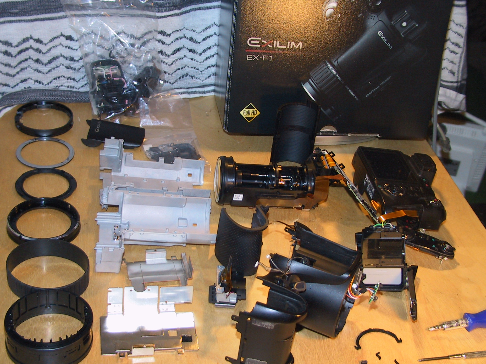

# Documentation
## Info about projects and tools.

- [Image Sensor `sc223a` in OpenIPC](sc223a.md)
- [`OpenIPC` device info and settings](OpenIPC-devices.md)
- [Disassemble Ex-F1 high speed camera](EX-F1/exf1-disassemle.md)
- 
- [Compile `exf1ctrl` on linux](exf1ctrl-on-linux.md)
- [`esphome` source local changes](esphome-local-changes.md)
- [Translation of `Github English to German`](githubToGerman.md)
- [Things you should `not` do on Linux Terminal](things-you-should-not-do-on-linux-terminal.md)
